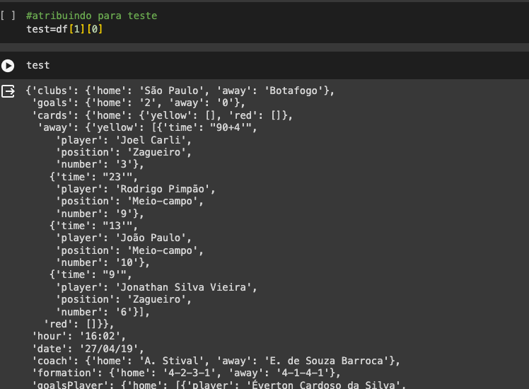
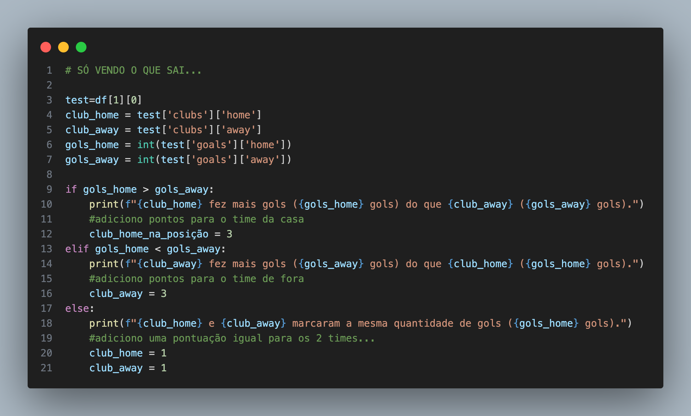
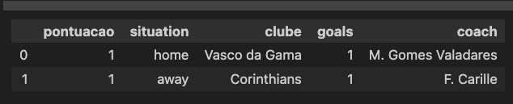
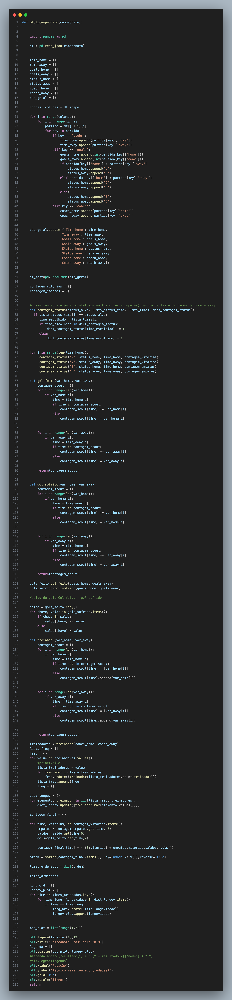
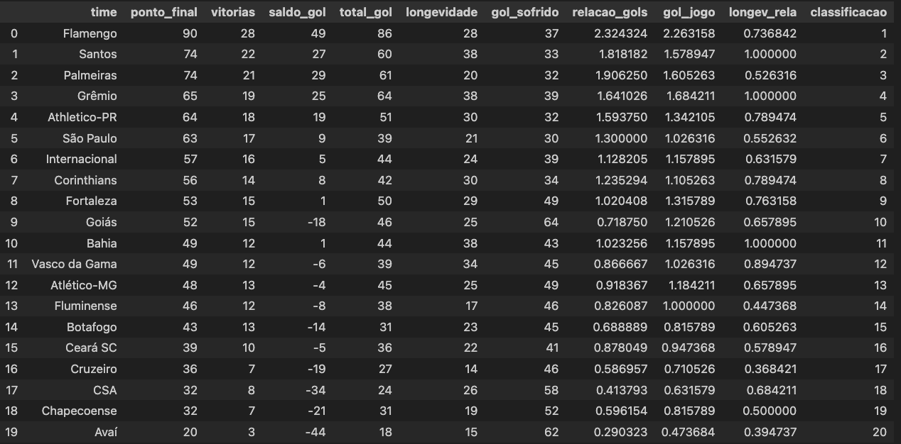
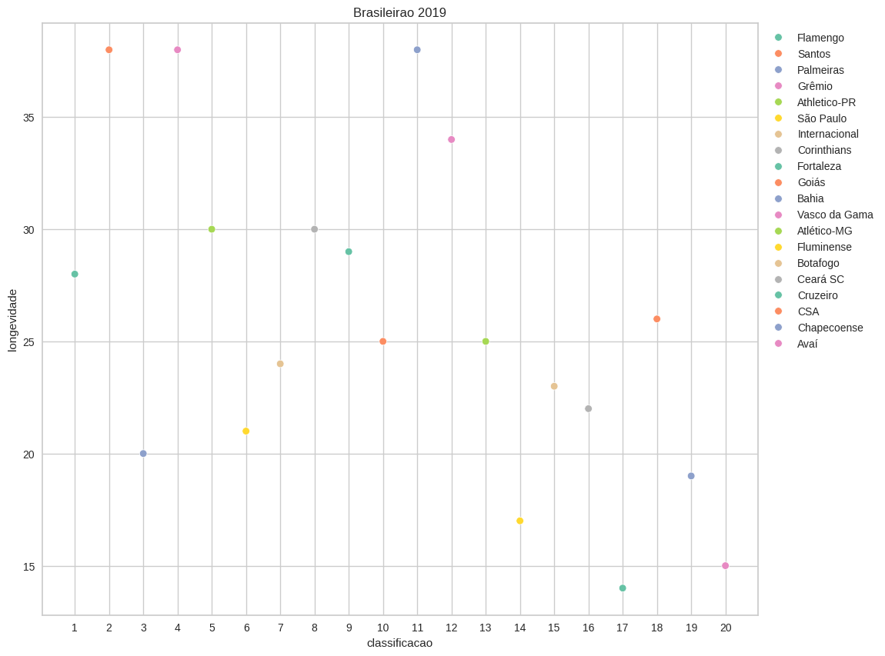
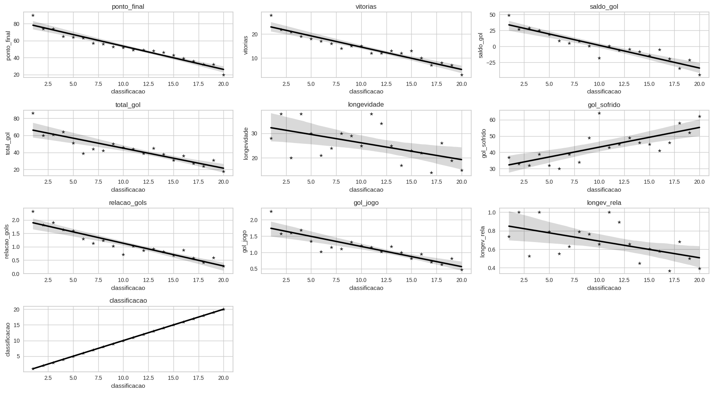
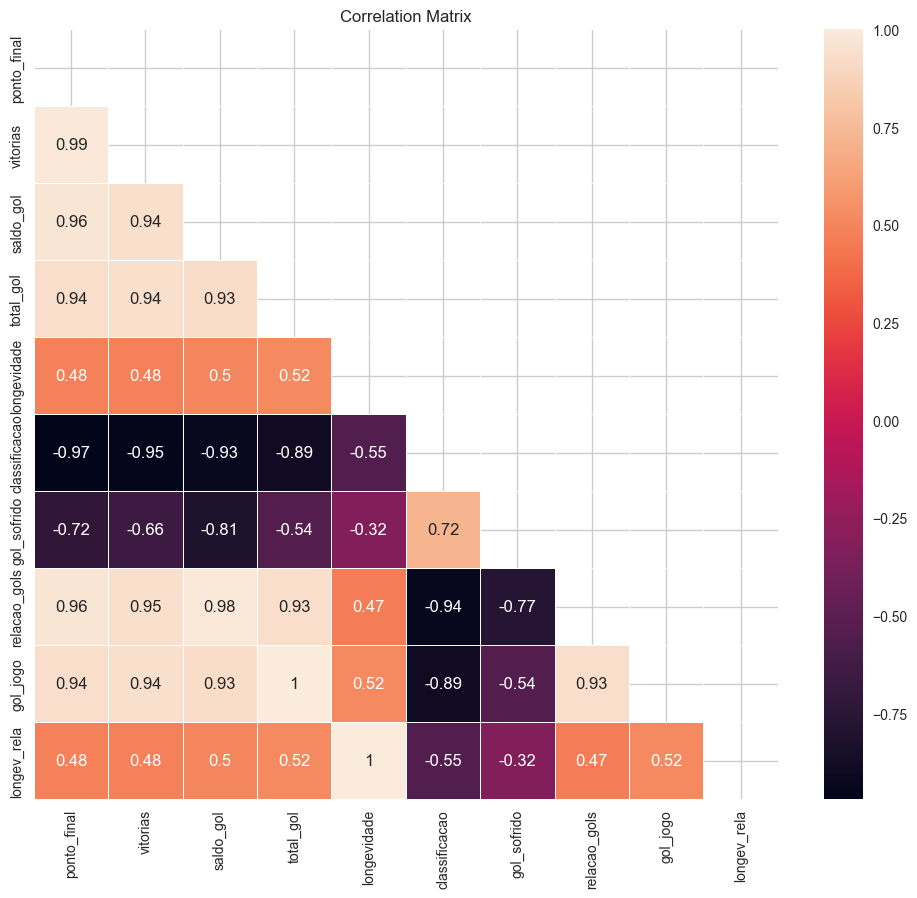

# Brasileirão and Serie A

The **Campeonato Brasileiro**, also known as **Brasileirão** and **Série A**, is the Brazilian professional football league among clubs from Brazil, being the main football competition in the country. It is where the Brazilian representatives for the Copa Libertadores da América are indicated, along with the champion of the Copa do Brasil. The champion of the tournament also earns a spot in the Supercopa do Brasil the following year.

# Project Scope

### For reproducibility suggests the following guidelines:

```
bash

conda create -n myvenv python=3.9

conda activate myvenv

pip install -r Requirements.txt

conda deactivate

```
The project is based on the phases of using CRISP-DM to solve the problem, with minor adaptations for **PR_V1**

Following the following steps:

1. Business understanding
2 . Data Understanding
3. Data Preparation
4. Modeling
5. Evaluation
6. Deploy
7. Feedbacks

### V1 does not include Deployment and Feedbacks after deployment.

# Business understanding
A new professional team, **ADA-Santander Football Club** , emerges on the national scene with a revolutionary vision. Its board and management are committed to transforming the football landscape, not only at the national level, but also on a global scale. They firmly believe that data, hitherto underutilized, is the key to success, contrasting with the traditional and often emotional approach that permeates decision-making in sports.

ADA-Santander Football Club is adopting an innovative approach by implementing data-driven management. This change encompasses various sectors crucial to the club's performance, including signings, contract renewals, salary negotiations, dismissals, and even the selection and hiring of coaches.

Believing that data analysis can provide valuable insights and inform more effective strategies, the team is committed to bringing a more grounded and scientific mindset to decisions that directly impact the team's performance and success. This innovative approach seeks not only to improve results on the field but also to establish a new standard of excellence in the football universe, standing out for efficiency, strategic planning, and technological foresight.

# Data Understanding

A model dataset was used (Brazilian championship of 2019), containing the structure in JSON format, with a total of 38 columns and 10 rows in total.

There are no duplicate data or NaN or null values within our dataset.

For each cell, there were statistical data for each round's matches.



A test code was used to extract the necessary information for only 1 single cell.



After being able to extract the information, we created a pandas table to facilitate the visualization of the result.



# Data Preparation 

For data preparation, we created a function where it receives a parameter that will be the dataset to be analyzed, following an example of the implemented code.

The data was extracted and worked on to obtain information on final placements, goal difference, coach longevity, goals scored.



## Obtaining a result



# Conclusion

The question raised by the board about the existence of a relationship between longevity and the final position of the teams cannot be answered categorically.



However, for a more visual answer, a regression plot and a heatmap were used to understand the correlation between variables.

**REGPLOT**



**HEATMAP**



Through these two graphs, we can understand that longevity presents a medium correlation with the final placement. However, as we are analyzing only a single year, we cannot affirm more emphatically, avoiding bias in our analysis.

# Thank you very much
**Collaborators**

Marcel Cleres - https://www.linkedin.com/in/marcelcleres/

Ane Carol - https://www.linkedin.com/in/anecarolineferreira/

Chen Yen Pin - https://www.linkedin.com/in/chen-yen-pin/

Jesya de Lima - https://www.linkedin.com/in/jesyadelima/

Gabriel Alvarenga - https://www.linkedin.com/in/gabriel-alvarenga-rocha-994b5120a/

Gabriel Vilarinho - https://www.linkedin.com/in/gabriel-vilarinho/

Grabriela Mendes - https://www.linkedin.com/in/gabriele-mendes-adorno-46719493?utm_source=share&utm_campaign=share_via&utm_content=profile&utm_medium=android_app

Renan Silva - https://www.linkedin.com/in/renan-msilva?utm_source=share&utm_campaign=share_via&utm_content=profile&utm_medium=android_app 


